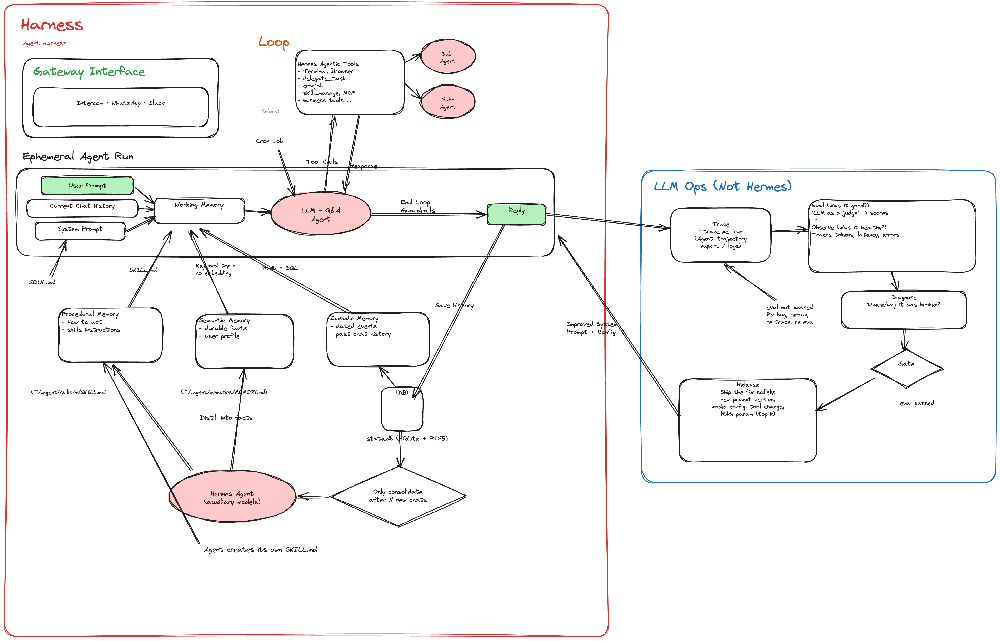

# cs-agent

Customer-support agent for **Cashea** (a Buy-Now-Pay-Later service): a single
LLM-driven agent, backed by a small, ownable harness — not a rigid intent
classifier, not a heavy agent framework.

**Guiding principle — `Agent = Model + Harness`.** The model reasons; the
harness guarantees. Every business decision (approve a payment, issue a
refund, escalate to a human) is deterministic, testable code — never a
free-text LLM judgment call.

## Architecture



This is the general harness shape the project follows: a gateway in front of
whichever channel reaches the customer, an ephemeral per-turn loop that
assembles working memory (soul + durable memory + on-demand skills +
history) and calls the model, and an LLM-ops loop (trace → eval → diagnose →
gate → release) that turns production issues into eval cases and prompt/config
fixes — never a silent patch.

Not every box is built yet. `agent-service/CLAUDE.md` §4 and §9 are the source
of truth for what's live today vs. planned (e.g. procedural memory / skills
and multi-channel gateways beyond the web widget are still ahead).

## Repo layout

```
cs-agent/
├── agent-service/   FastAPI + the agent loop (agent/ = the brain, service/ = the transport)
├── frontend/        Next.js chat widget + dashboard
├── mock-server/     BNPL backend the agent's tools call against (Hono + Bun)
├── merchant-mock-server/  Merchant (aliado) backend — orders, payouts, invoices (Hono + Bun)
└── docker-compose.yml
```

- **`agent-service/`** — the harness: `agent/loop`, `agent/tools`, `agent/memory`
  (semantic/episodic/procedural), `agent/runtime` (per-turn working memory).
  See `agent-service/CLAUDE.md` for the operating contract and
  `agent-service/docs/ADR/` for the design decisions behind it.
- **`frontend/`** — the chat UI (standalone page + embeddable widget) and a
  small dashboard for the simulated host-app identity.
- **`mock-server/`** — a stand-in BNPL backend (orders, payments, users) so
  the agent's tools have something real to call locally.
- **`merchant-mock-server/`** — a stand-in merchant (aliado) backend (orders,
  payouts, invoices, conciliation, promotions, POS, inventory) so the merchant
  support agent has realistic data to resolve cases with.

## Quickstart

```bash
docker compose up --build
```

| Service         | URL                            | What it is                          |
| --------------- | ------------------------------- | ------------------------------------ |
| `frontend`      | http://localhost:3000           | Next.js chat UI                      |
| `agent-service` | http://localhost:8000 (`/docs`) | FastAPI agent loop                   |
| `mock-server`   | http://localhost:3001           | BNPL backend the agent's tools call  |
| `merchant-mock-server` | http://localhost:3002    | Merchant (aliado) backend            |
| `phoenix`       | http://localhost:6006           | OTel trace viewer (local dev)        |
| `postgres`      | localhost:5433                  | agent memory & sessions              |

Source is bind-mounted for both dev servers — no rebuild needed after a code
change, only after a manifest changes (`pyproject.toml`/`uv.lock`,
`package.json`/lockfiles).

## Docs

- `agent-service/CLAUDE.md` — the operating contract: principles, repo layout,
  conventions, what's built vs. planned.
- `agent-service/docs/ADR/` — architecture decisions (harness design, memory &
  session persistence, semantic memory/pgvector).
- `agent-service/docs/SECURITY.md` — known limitations and accepted risks.
